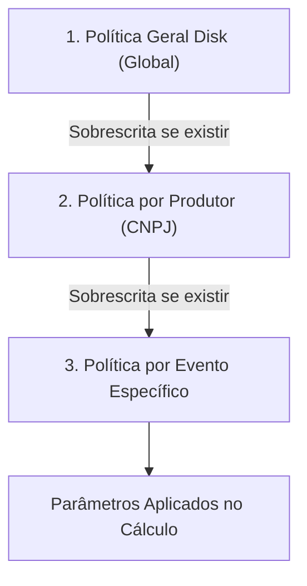
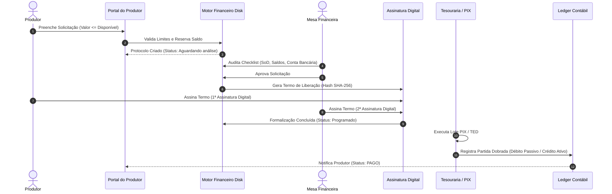

# Manual Oficial de Regras, Elegibilidade e Governança de Repasses Financeiros
### Disk Ingressos — Core Financeiro Unificado (ERP / CRM)

---

## 1. Visão Geral e Princípios Fundamentais

O **Repasse Financeiro** é o adiantamento legal e controlado de receitas de bilheteria ao Produtor antes da liquidação final do evento (Borderô). O objetivo do motor de repasses é viabilizar o fluxo de caixa da produção artística garantindo simultaneamente a **segurança financeira da Disk Ingressos**, a **proteção contra estornos/chargebacks**, a **reserva de obrigações de terceiros** e a **segregação patrimonial por evento**.

### Distinções Canônicas de Produtos Financeiros
| Operação | Natureza | Origem dos Recursos | Momento de Liquidação |
| :--- | :--- | :--- | :--- |
| **Repasse de Bilheteria** | Liberação parcial de receitas de vendas já realizadas | Saldo em conta do evento na Disk | Durante a pré-venda do evento |
| **Antecipação de Recebíveis** | Operação de crédito com taxa de desconto (MDR/spread) | Recebíveis futuros de cartão (D+30) | Contratação imediata pré-faturamento |
| **Fechamento de Borderô** | Quitação e apuração definitiva do evento | Saldo remanescente pós-evento | Pós-realização do evento |

---

## 2. A Regra Comercial Canônica (Gatilho 50% / Liberação 20%)

Por padrão corporativo da Disk Ingressos, todo evento segue a política de segurança comercial:

```text
┌────────────────────────────────────────────────────────┐
│ GATILHO MÍNIMO DE VENDAS : 50% da Meta do Evento       │
│ LIMITE BRUTO DE LIBERAÇÃO: 20% das Vendas Realizadas   │
└────────────────────────────────────────────────────────┘
```

### 2.1. Variáveis de Entrada
- **`salesTarget` (Meta de Vendas)**: Valor bruto total estimado de arrecadação do evento (capacidade × preço médio ou valor cadastrado).
- **`grossSales` (Vendas Brutas Realizadas)**: Total faturado até o instante da consulta (ingressos emitidos).
- **`progressPercent` (Progresso de Vendas)**:
  $$\text{Progresso (\%)} = \frac{\text{grossSales}}{\text{salesTarget}} \times 100$$

### 2.2. Avaliação de Gatilho de Venda
1. **Se $\text{progressPercent} < 50\%$**:
   - Status do Repasse: **`BLOQUEADO`**
   - $\text{Limite Bruto} = \text{R\$}~0,00$
   - $\text{Faltam Vendas} = (\text{salesTarget} \times 0,50) - \text{grossSales}$
   - O formulário de solicitação no Portal do Produtor fica desabilitado com aviso explicativo do valor faltante.
2. **Se $\text{progressPercent} \ge 50\%$**:
   - Status do Repasse: **`HABILITADO`**
   - $\text{Limite Bruto} = \text{grossSales} \times 0,20$ (20% das vendas acumuladas)
   - $\text{Faltam Vendas} = \text{R\$}~0,00$
   - O produtor pode solicitar repasse até o limite disponível calculado após deduções.

---

## 3. Fórmula Canônica de Cálculo do Disponível Líquido

O valor final liberado para solicitação resulta da aplicação do limite bruto subtraído de todas as deduções operacionais e travado pelo saldo financeiro real em conta:

$$\text{Disponível Líquido} = \min\Big(\text{Saldo Real do Evento},\; \max\big(0,\; \text{Limite Bruto} - \text{Total Deduções}\big)\Big)$$

### 3.1. Quadro de Deduções Obrigatórias por Evento

As deduções são **estritamente segregadas por evento**. O que ocorre no Evento A não pode contaminar a elegibilidade do Evento B:

| Dedução | Descrição | Impacto |
| :--- | :--- | :--- |
| **`previousPayouts`** | Repasses anteriores já realizados sob a política para o evento | Subtrai do limite de 20% |
| **`blockedBalance`** | Bloqueios judiciais, cautelares ou administrativos do evento | Subtrai do limite de 20% |
| **`reservedBalance`** | Valores reservados para solicitações em andamento | Subtrai do limite de 20% |
| **`retainedBalance`** | Retenções contratuais de garantia acordadas em aditivo | Subtrai do limite de 20% |
| **`creditAmortizationHold`** | Amortização de crédito/mútuo concedido ao produtor vinculado ao evento | Subtrai do limite de 20% |
| **`obligationsHold`** | Obrigações financeiras da agenda do evento em status `RESERVADO` ou `RETIDO` (aluguel, ECAD, riders) | Subtrai do limite e trava saldo real |
| **`refundsHold`** | Estornos em processo de dupla autorização ou efetivação | Subtrai do limite e trava saldo real |
| **`executedRefunds`** | Estornos já efetivados pela operadora debitados do evento | Subtrai do limite de 20% |

$$\text{Total Deduções} = \text{RepassesAnteriores} + \text{Bloqueios} + \text{Reservas} + \text{Retenções} + \text{AmortizaçãoCrédito} + \text{Obrigações} + \text{Estornos}$$

### 3.2. Trava de Saldo Real em Conta
Mesmo que a fórmula do limite comercial aponte um valor elevado, **o repasse nunca pode ultrapassar o saldo líquido real do evento**:
$$\text{Saldo Real do Evento} = \max\big(0,\; \text{Saldo Bruto em Conta} - \text{obligationsHold} - \text{refundsHold}\big)$$

---

## 4. Hierarquia e Sobrescrita de Políticas

O motor financeiro resolve os parâmetros de repasse seguindo estrita ordem hierárquica em 3 níveis:



1. **Nível 1 — Geral Disk (Global)**: Aplicado a todos os eventos e produtores (`minSalesPercent = 50%`, `releasePercent = 20%`).
2. **Nível 2 — Produtor**: Ajustes negociados com produtores corporativos de grande porte (ex: 40% de vendas mínimas e 25% de liberação). Prevalece sobre o Geral Disk.
3. **Nível 3 — Evento Específico**: Ajuste pontual para uma turnê ou festival específico (ex: 30% de vendas mínimas e 15% de liberação). Tem prioridade máxima sobre os anteriores.

Parâmetros adicionais configuráveis em cada escopo:
- `considerCreditAmortization`: deduzir parcelas de créditos ativos (padrão: `true`).
- `considerRefunds` / `considerChargebacks`: considerar reservas de contestações (padrão: `true`).
- `requireValidatedBank`: exigir conta bancária homologada pela Tesouraria (padrão: `true`).
- `requireDigitalSignature`: exigir fluxo de assinatura eletrônica do termo (padrão: `true`).

---

## 5. Autorização Excepcional (A Trava Humana)

Para eventos estratégicos que não atingiram 50% de vendas ou necessitam de capital de giro emergencial para infraestrutura, existe o dispositivo de **Autorização Excepcional**.

### 5.1. Regras de Segregação de Funções (SoD)
- **Produtor**: **PROIBIDO** de emitir ou aprovar autorizações excepcionais. Qualquer tentativa é bloqueada pela API com erro `403 Forbidden`.
- **Mesa Financeira Disk**: Apenas operadores autorizados do Financeiro/Diretoria Disk podem conceder exceções.

### 5.2. Requisitos Mandatórios da Exceção
1. **Justificativa Formal Obrigatória**: Texto detalhado com **no mínimo 5 caracteres** explicando o motivo comercial e registrando a alçada responsável para a auditoria.
2. **Limite Físico do Saldo**: O valor da exceção não pode exceder o saldo financeiro real em conta do evento.
3. **Consumo Atômico de Uso Único**:
   - A autorização excepcional fica em status `ATIVA`.
   - Ao ser utilizada em uma solicitação de repasse, ela é **consumida atomicamente**:
     - `consumed = true`
     - `payoutId = REP-XXXXX`
     - `consumedAt = Timestamp ISO`
   - Após o consumo, o evento retorna imediatamente à sua regra matemática padrão (evitando liberação múltipla indevida).

---

## 6. Segregação Patrimonial e Isolamento por Evento

Cada evento opera como uma **unidade de patrimônio de afetação contábil**:
- As obrigações (ex: fornecedores de som, taxas municipais) cadastradas para o Evento X reservam saldo **apenas** no Evento X.
- O limite e as deduções de repasse do Evento X **não afetam** o disponível para repasse do Evento Y do mesmo produtor.
- Estornos e contestações de ingressos incidem unicamente sobre o evento originador da venda.

---

## 7. Workflow de Aprovação e Governança do Repasse (7 Etapas)



### Detalhamento das Etapas:
1. **Solicitação (`Aguardando análise`)**: O produtor seleciona o evento, digita o valor até o limite permitido e escolhe a conta bancária homologada.
2. **Análise Financeira (`Em análise`)**: O operador de backoffice checa documentação, dados bancários e integridade de vendas.
3. **Aprovação (`Aprovado`)**: Homologação formal com segregação de funções (o usuário que aprova não pode ser o mesmo que solicitou).
4. **1ª Assinatura Digital (`Aguardando assinatura do Produtor`)**: O produtor assina digitalmente o termo com registro de IP, data/hora e hash criptográfico SHA-256.
5. **2ª Assinatura Digital (`Aguardando assinatura da Disk`)**: A diretoria financeira da Disk Ingressos realiza a contrassignatura formal.
6. **Programação em Tesouraria (`Documento formalizado` / `Programado`)**: Remessa enviada para a fila de pagamentos bancários (PIX / CNAB 240).
7. **Liquidação e Contabilização (`Pago`)**:
   - Transferência bancária efetivada via PIX/TED.
   - Lançamento contábil automático no **Ledger em partidas dobradas**:
     - **DÉBITO**: *Passivo Circulante — Obrigações com Produtores (Produtora ABC)*
     - **CRÉDITO**: *Ativo Circulante — Conta Movimento Bancária (Banco Itaú Disk Ingressos)*

### Cenário de Rejeição Formal
Caso a solicitação apresente inconsistências (ex: *Inconsistência nos Dados Bancários*, *Bloqueio Judicial Superveniente* ou *Suspeita de Chargeback*):
- O operador seleciona o motivo categórico obrigatório e insere justificativa.
- O status transita para **`Rejeitado`**.
- Os valores reservados são **estornados atomicamente** de volta ao saldo disponível do evento no mesmo milissegundo.

---

## 8. Casos Práticos de Aplicação

### Caso A: Festival Curitiba 2026 (`evt-001`) — Repasse Canônico Habilitado
- **Meta de Vendas**: R$ 1.000.000,00
- **Vendas Brutas Realizadas**: R$ 500.000,00 (Progresso: exatamente 50,0%)
- **Regra**: Atingiu gatilho $\ge 50\%$.
- **Limite Bruto (20%)**: $500.000,00 \times 0,20 = \text{R\$}~100.000,00$
- **Deduções Anteriores do Evento**: R$ 0,00
- **Disponível para Repasse**: **R$ 100.000,00** (`HABILITADO`)
- **Operação Executada**: Produtor solicita R$ 80.000,00 com sucesso (`REP-00291`), restando R$ 20.000,00 de limite.

### Caso B: Turnê Rock Arena (`evt-002`) — Bloqueio por Vendas Insuficientes
- **Meta de Vendas**: R$ 600.000,00
- **Vendas Brutas Realizadas**: R$ 250.000,00 (Progresso: 41,7%)
- **Gatilho de 50%**: R$ 300.000,00
- **Resultado**: $\text{Progresso} < 50\% \implies \text{Status}$ **`BLOQUEADO`**
- **Faltam Vendas**: $300.000,00 - 250.000,00 = \text{R\$}~50.000,00$
- **Disponível**: **R$ 0,00**
- **Tratamento de Exceção**: A diretoria emite autorização excepcional de R$ 35.000,00 com justificativa formal para montagem de palco, liberando temporariamente a submissão de até R$ 35.000,00 (`EXCECAO_AUTORIZADA`).

### Caso C: Festival de Inverno (`evt-inverno`) — Repasse com Múltiplas Deduções
- **Meta de Vendas**: R$ 1.000.000,00
- **Vendas Realizadas**: R$ 520.000,00 (Progresso: 52,0% $\ge 50\%$)
- **Limite Bruto (20%)**: $520.000,00 \times 0,20 = \text{R\$}~104.000,00$
- **Repasses Anteriores Já Pagos**: R$ 40.000,00
- **Bloqueios Administrativos do Evento**: R$ 10.000,00
- **Total Deduções**: $\text{R\$}~50.000,00$
- **Disponível Final**: $104.000,00 - 50.000,00 = \textbf{R\$}~\mathbf{54.000,00}$ (`HABILITADO`)

---

## 9. Rastreabilidade, Logs e Auditoria

Todas as etapas do ciclo de repasse gravam eventos na trilha de auditoria (`auditLogs`):
- `EVENTO`: Data e hora exata em formato ISO 8601.
- `ATOR`: ID, nome, cargo e perfil de acesso do responsável.
- `OPERAÇÃO`: `SOLICITACAO_REPASSE`, `AUTORIZACAO_EXCEPCIONAL`, `APROVACAO_REPASSE`, `ASSINATURA_DIGITAL_PRODUTOR`, `ASSINATURA_DIGITAL_DISK`, `PAGAMENTO_PIX`, `REJEICAO_REPASSE`.
- `INTEGRIDADE`: Hash SHA-256 gerado a partir do payload canônico da transação.
